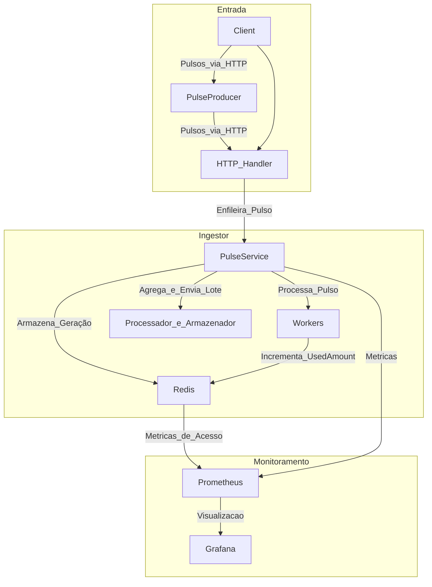
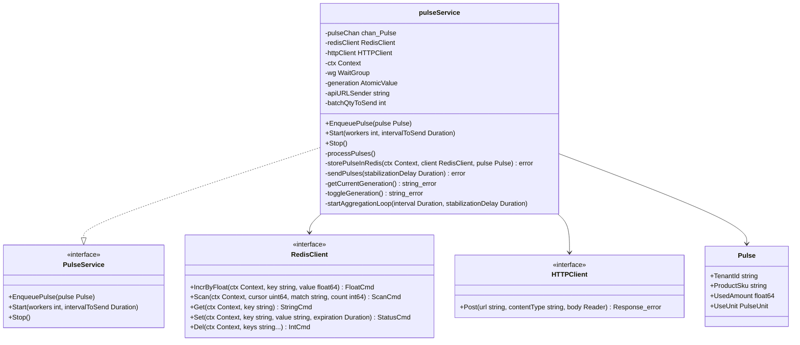
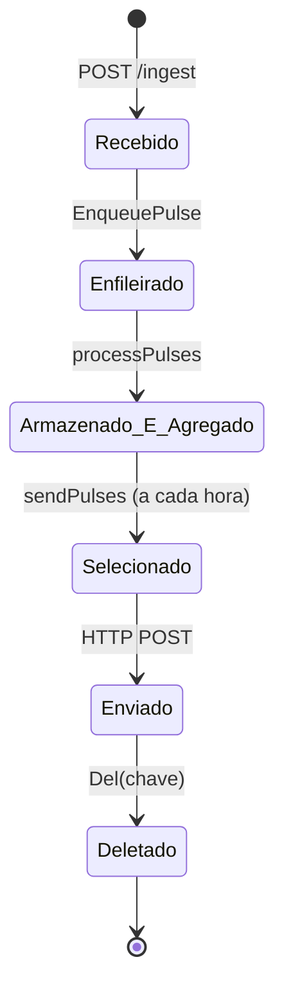

# Ingestor de Consumo

## Descrição

Este projeto implementa o Ingestor do sistema de bilhetagem de consumo. O Ingestor é responsável por:

- Receber pulsos de consumo via API HTTP (POST /ingest).
- Processar os pulsos assincronamente usando canais e workers.
- Armazenar e agregar os pulsos no Redis com gerações alternadas (A e B).
- Enviar os pulsos agregados a cada hora para o Processador & Armazenador.

O sistema suporta 2000 req/s e foi projetado para ser escalável em produção. O Redis, Prometheus e Grafana são configurados via Docker Compose para persistência, monitoramento e visualização de métricas. Um pulseProducer foi implementado para simular o envio de pulsos ao Ingestor, permitindo testar diferentes níveis de produção.

## Pré-requisitos

- Go 1.18 ou superior.
- Docker e Docker Compose (para rodar Redis, Prometheus e Grafana).
- Um editor de texto para ajustar configurações (ex.: VS Code).

## Estrutura do Projeto

- **cmd/ingestor/main.go:** Ponto de entrada do Ingestor.
- **cmd/producer/main.go:** Ponto de entrada do pulseProducer, usado para simular o envio de pulsos.
- **grafana-provisioning/:** Configurações de provisionamento do Grafana (ex.: datasources, dashboards).
- **internal/clients/:** Utilitários para HTTP, logging e Redis.
  - _http.go:_ Cliente HTTP para envio de pulsos.
  - _log.go:_ Configuração do logging com Zerolog.
  - _redis.go:_ Cliente Redis para persistência e agregação.
- **internal/pulse/:** Lógica do Ingestor.
  - _domain.go:_ Definição da estrutura de um pulso.
  - _handler.go:_ Handler HTTP para o endpoint /ingest.
  - _service.go:_ Lógica do Ingestor (canal, workers, disparo).
- **internal/pulseproducer/:** Lógica do pulseProducer (simulação de envio de pulsos).
  - _generator.go:_ Geração de pulsos simulados.
  - _service.go:_ Lógica do pulseProducer (envio assíncrono de pulsos).
- **log/:** Diretório para logs.
  - _log_ingestor.log:_ Logs do Ingestor.
  - _log_sender.log:_ Logs do pulseProducer.
- **scripts/:** Scripts para executar o Ingestor e o pulseProducer.
  - _run_ingestor.ps1:_ Script PowerShell para executar o Ingestor (Windows).
  - _run_ingestor.sh:_ Script Bash para executar o Ingestor (Linux).
  - _run_producer.ps1:_ Script PowerShell para executar o pulseProducer (Windows).
  - _run_producer.sh:_ Script Bash para executar o pulseProducer (Linux).
- **.gitignore:** Arquivo para ignorar arquivos gerados (ex.: logs, binários).
- **docker-compose.yml:** Configuração dos serviços Redis, Prometheus e Grafana.
- **prometheus.yml:** Configuração do Prometheus para monitoramento.
- **Dockerfile:** Dockerfile para o Ingestor (opcional, não utilizado no momento).
- **.env:** Arquivo de variáveis de ambiente.
- **example.env:** Exemplo de arquivo .env.
- **go.mod:** Dependências do Go.
- **go.sum:** Dependências do Go.

_Nota:_ A maioria dos arquivos terá seus respectivos testes terminados em _test.go.

## Como Instalar

Clone o repositório:

```bash
git clone git@github.com:ThalysSilva/ingestor-consumo.git
cd ingestor-consumo
```

Instale as dependências do Go:

```bash
go mod tidy
```

## Configuração do Ambiente

Crie um arquivo **.env** na raiz do projeto com as seguintes variáveis (você pode usar o **example.env** como base):

```bash
INGESTOR_PORT=8070
REDIS_HOST=redis
REDIS_PORT=6379
API_URL_SENDER=http://localhost:8090/process
```

- `REDIS_HOST=redis` refere-se ao nome do serviço Redis no Docker Compose.
- `INGESTOR_PORT=8070` deve corresponder ao targets no prometheus.yml.

Ajuste o arquivo **prometheus.yml** para o seu sistema operacional:

### Windows:

O `host.docker.internal` funciona nativamente:

```yaml
global:
  scrape_interval: 15s

scrape_configs:
  - job_name: "pulse-ingestor"
    static_configs:
      - targets: ["host.docker.internal:8070"]
```

### Linux:

O `host.docker.internal` não é suportado nativamente. Use `localhost` ou o IP da máquina host (ex.: 172.17.0.1 ou o IP da sua máquina). Exemplo:

```yaml
global:
  scrape_interval: 15s

scrape_configs:
  - job_name: "pulse-ingestor"
    static_configs:
      - targets: ["localhost:8070"]
```

_Nota:_ Se você decidir rodar o Ingestor como um serviço no Docker Compose, o target seria `ingestor:8070`, e você precisaria adicionar o Ingestor ao **docker-compose.yml**.

## Como Executar

Suba os serviços Redis, Prometheus e Grafana usando Docker Compose:

```bash
docker-compose up -d
```

Isso iniciará:

- Redis na porta 6379.
- Prometheus na porta 9090.
- Grafana na porta 3000.

Execute o Ingestor localmente:

### Windows:
```bash
.\scripts\run_ingestor.ps1
```
_Nota:_ É necessário liberar a execução de scripts do windows. Para isso, Abra um powershell em **modo de administrador** e execute: `Set-ExecutionPolicy RemoteSigned -Scope CurrentUser`

### Linux:

```bash
./scripts/run_ingestor.sh
```

O Ingestor estará rodando em `http://localhost:8070`.  
As métricas estarão disponíveis em `http://localhost:8070/metrics`.

Acesse o Prometheus para verificar as métricas:

- Abra `http://localhost:9090` no navegador.
- Verifique métricas como `pulse_channel_size`, `pulses_sent_total` e `pulses_sent_failed_total`.

Acesse o Grafana para visualizar as métricas:

- Abra `http://localhost:3000` no navegador.
- Faça login com usuário `admin` e senha `admin`.
- Configure um datasource para o Prometheus (URL: `http://prometheus:9090`).
- Crie dashboards para visualizar as métricas do Ingestor.

_Nota:_ O cliente Http está mockado para concluir a execução dos ciclos de envio. Caso queira integrar um servidor para receptar, será necessário remover o mock `pulse.WithCustomHTTPClient(mockHTTPClient)` dentro do main.go (`cmd/ingestor/main.go`), além de toda definição deles. Também é necessário alterar a variável de ambiente do `API_URL_SENDER` para o endereço do receptor desejado.

## Como Testar

### Usando o pulseProducer

O pulseProducer (em `cmd/producer/main.go`) simula o envio de pulsos ao Ingestor, permitindo testar diferentes níveis de produção. Ele cria goroutines para simular múltiplas origens de pulsos (definidas por `qtyTenants`), com delays configuráveis entre `minDelay` e `maxDelay`.

Configurações padrão (ajustáveis no código):

- `qtyTenants = 3000`: Número de "origens" de pulsos (goroutines).
- `minDelay = 500`: Delay mínimo entre envios (em milissegundos).
- `maxDelay = 1000`: Delay máximo entre envios (em milissegundos).
- `timeDuration = 100 * time.Second`: Duração total do teste.
- `qtySKUs = 10`: Número de SKUs diferentes para simulação.

Para executar o pulseProducer:

### Windows:

```bash
.\scripts\run_producer.ps1
```

### Linux:

```bash
./scripts/run_producer.sh
```

O pulseProducer enviará pulsos para `http://localhost:8070/ingest` por 100 segundos e depois encerrará.

### Envio Manual (Opcional)

Você também pode enviar pulsos manualmente via curl:

```bash
curl -X POST http://localhost:8070/ingest -H "Content-Type: application/json" -d '{"tenant_id":"tenant_xpto","product_sku":"SKU-77","used_amount":307,"use_unity":"KB"}'
```

## Verificação

- Verifique os logs do Ingestor no console e no arquivo `log/log_ingestor.log`.
- Verifique os logs do pulseProducer no console e no arquivo `log/log_sender.log`.
- Acesse as métricas em `http://localhost:8070/metrics`.
- Visualize os dados no Grafana (`http://localhost:3000`).

## Parando os Serviços

Para parar os serviços do Docker Compose:

```bash
docker-compose down
```

## Decisões Técnicas

- **Canais (Go):** Escolhidos para processamento assíncrono, permitindo alta taxa de ingestão (2000 req/s).
- **Redis:** Usado para persistência e agregação, com operações atômicas (`HIncrByFloat`).
- **Gerações Alternadas (A e B):** Introduzidas para evitar race conditions entre leitura e deleção.
- **Prometheus e Grafana:** Para monitoramento e visualização de métricas.
- **Zerolog:** Para logging detalhado.
- **PulseProducer:** Implementado para simular o envio de pulsos, permitindo testar o Ingestor com diferentes cargas.

## Considerações para Produção

Em um ambiente de produção, a arquitetura seria ajustada para maior escalabilidade e modularidade:

- **Load Balancer:** Um load balancer seria adicionado para distribuir requisições entre múltiplas instâncias do Ingestor.
- **Redis Central:** Um Redis central com coordenação (ex.: lock distribuído) poderia ser usado para simplificar a operação e facilitar a agregação global.
- **Microserviço de Disparo:** A Etapa 3 (disparo e deleção) seria delegada a um microserviço independente (ex.: PulseSender), permitindo desacoplamento e escalabilidade independente.

## Diagrama de sequência


## Diagrama de Fluxo de Dados

O diagrama abaixo ilustra o fluxo de dados (pulsos) pelo sistema:



## Diagrama de Classes

O diagrama abaixo mostra a estrutura estática do código, incluindo as principais structs e interfaces:



## Diagrama de Estados

O diagrama abaixo mostra o ciclo de vida de um pulso no sistema:




## Licença

Este projeto está licenciado sob a licença MIT. Veja o arquivo LICENSE para mais detalhes.

