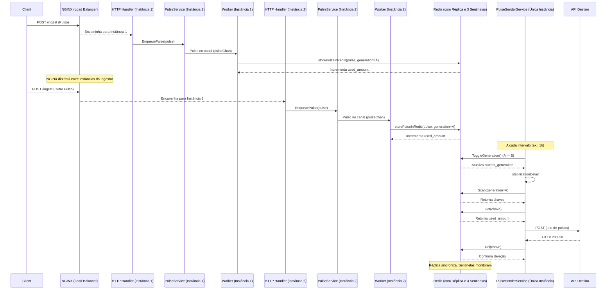
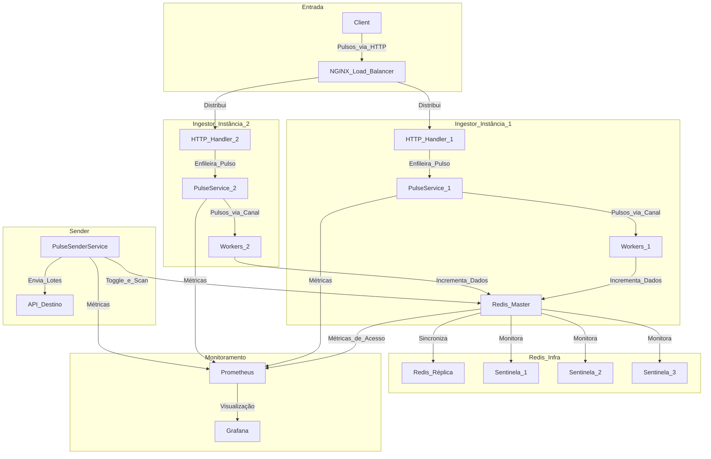
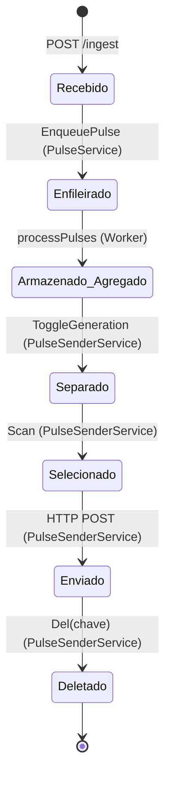

# Ingestor de Consumo

## Descrição

Este projeto implementa o Ingestor do sistema de bilhetagem de consumo. O Ingestor é responsável por:

- Receber pulsos de consumo via API HTTP (POST /ingest).
- Processar os pulsos assincronamente usando canais e workers.
- Armazenar e agregar os pulsos no Redis com gerações alternadas (A e B).
- Enviar os pulsos agregados a cada hora para o Processador & Armazenador.

O sistema suporta 1000 req/s e foi projetado para ser escalável em produção. O Redis, Prometheus, Grafana e o ingestor são configurados via Docker Compose para persistência, monitoramento e visualização de métricas. Um pulseProducer foi implementado para simular o envio de pulsos ao Ingestor, permitindo testar diferentes níveis de produção.

## Pré-requisitos

- Go 1.18 ou superior.
- Docker e Docker Compose (para rodar Redis, Prometheus, Grafana, ingestor e produtor).
- Um editor de texto para ajustar configurações (ex.: VS Code).

## Estrutura do Projeto
- **build/:** Pasta contendo arquivos referente a infraestrutura (dockerfile, grafana, prometheus, etc.)
- **cmd/ingestor/main.go:** Ponto de entrada do Ingestor.
- **cmd/producer/main.go:** Ponto de entrada do pulseProducer, usado para 
simular o envio de pulsos.
- **cmd/sender/main.go:** Ponto de entrada do sender.
- **internal/clients/:** Utilitários para HTTP, logging e Redis.
- **internal/pulse/:** Lógica do Ingestor(consumidor e processador).
- **internal/pulseproducer/:** Lógica do pulseProducer (simulação de envio de pulsos).
- **internal/pulsesender/:** Lófica do pulseSender (disparo de envios e deleção)
- **log/:** Diretório para logs.
- **scripts/:** Scripts para executar o pulseProducer.
- **pkg/:** Pacotes para complemento das regras de negócios.
- **.gitignore:** Arquivo para ignorar arquivos gerados (ex.: logs, binários).
- **docker-compose.yml:** Configuração dos serviços Redis, Prometheus e Grafana.
- **.env:** Arquivo de variáveis de ambiente.
- **example.env:** Exemplo de arquivo .env.
- **go.mod:** Dependências do Go.
- **go.sum:** Dependências do Go.

_Nota:_ A maioria dos arquivos terá seus respectivos testes terminados em _test.go.

## Como Instalar

Clone o repositório:

```bash
git clone git@github.com:ThalysSilva/ingestor-consumo.git
cd ingestor-consumo
```

Instale as dependências do Go:

```bash
go mod tidy
```

## Configuração do Ambiente

Crie um arquivo **.env** na raiz do projeto com as seguintes variáveis (você pode usar o **example.env** como base):

```bash
INGESTOR_PORT=8080
NGINX_PORT=80
PULSE_SENDER_PORT=8081
NGINX_HOST=nginx
REDIS_PORT=6379
REDIS_HOST=redis-primary
API_URL_SENDER=http://localhost:8090/process
REDIS_SENTINEL_ADDRS=redis-sentinel-1:26379,redis-sentinel-2:26379,redis-sentinel-3:26379
```

- `REDIS_HOST` refere-se ao nome do serviço Redis no Docker Compose.
- `NGINX_HOST` refere-se ao nome do serviço nginx que faz o load balancer para as instancias do ingestor no Docker Compose.
- `NGINX_PORT` refere-se a porta do serviço nginx.
- `INGESTOR_PORT` deve corresponder ao targets no prometheus.yml.
- `API_URL_SENDER` É a api de destino que o pulseSender irá enviar ao coletar os dados do redis.

## Como Executar

Suba os serviços do Ingestor, Redis, Prometheus e Grafana usando Docker Compose:

```bash
docker-compose up -d
```

Isso iniciará:
_(caso utilize as envs do example.env)_

- NGINX na porta 80
- Redis na porta 6379.
- Prometheus na porta 9090.
- Grafana na porta 3000.

Métricas estarão disponíveis em `http://localhost:8080/metrics`.
Documentação da api disponível em `http://localhost:8080/swagger/index.html`

Acesse o Prometheus para verificar as métricas:

- Abra `http://localhost:9090` no navegador.
- Verifique métricas como `pulse_channel_size`, `pulses_sent_total` e `pulses_sent_failed_total`.

Acesse o Grafana para visualizar as métricas:

- Abra `http://localhost:3000` no navegador.
- Faça login com usuário `admin` e senha `admin`.
- Visualize os dashboards disponívels do pulse e pulseSender.

_Nota:_ O cliente Http está mockado para concluir a execução dos ciclos de envio. Caso queira integrar um servidor para receptar, será necessário remover o mock `pulsesender.WithCustomHTTPClient(mockHTTPClient)` dentro do main.go (`cmd/sender/main.go`), além de toda definição dele para o linter não acusar erro de variavel não utilizada. Também é necessário alterar a variável de ambiente do `API_URL_SENDER` para o endereço do receptor desejado.

## Como Testar

### Usando o pulseProducer

O pulseProducer (em `cmd/producer/main.go`) simula o envio de pulsos ao Ingestor, permitindo testar diferentes níveis de produção. Ele cria goroutines para simular múltiplas origens de pulsos (definidas por `qtyTenants`), com delays configuráveis entre `minDelay` e `maxDelay`.

Configurações padrão (ajustáveis no código):

- `qtyTenants = 200`: Número de "origens" de pulsos (goroutines).
- `minDelay = 100`: Delay mínimo entre envios (em milissegundos).
- `maxDelay = 400`: Delay máximo entre envios (em milissegundos).
- `timeDuration = 100 * time.Second`: Duração total do teste.
- `qtySKUs = 10`: Número de SKUs diferentes para simulação.

Para executar o pulseProducer:

### Windows:

```bash
.\scripts\run_producer-docker.ps1
```
_Nota:_ É necessário liberar a execução de scripts do windows. Para isso, Abra um powershell em **modo de administrador** e execute: `Set-ExecutionPolicy RemoteSigned -Scope CurrentUser`

### Linux:

```bash
./scripts/run_producer-docker.sh
```

O pulseProducer enviará pulsos para `http://nginx:80/ingest (http://localhost:8080)` por 100 segundos e depois encerrará.

### Envio Manual (Opcional)

Você também pode enviar pulsos manualmente via curl:

```bash
curl -X POST http://localhost:8080/ingest -H "Content-Type: application/json" -d '{"tenant_id":"tenant_xpto","product_sku":"SKU-77","used_amount":307,"use_unity":"KB"}'
```

## Verificação

- Verifique os logs do Ingestor no console e no arquivo `log/log_ingestor.log`.
- Verifique os logs do pulseProducer no console e no arquivo `log/log_producer.log`.
- Acesse as métricas em `http://localhost:8080/metrics`.
- Visualize os dados no Grafana (`http://localhost:3000`).

## Parando os Serviços

Para parar os serviços do Docker Compose:

```bash
docker-compose down
```

## Decisões Técnicas

- **Canais (Go):** Escolhidos para processamento assíncrono, permitindo alta taxa de ingestão (1000 req/s).
- **Redis (com replicas e sentinelas):** Usado para persistência e agregação, com operações atômicas (`HIncrByFloat`).
- **Gerações Alternadas (A e B):** Introduzidas para evitar race conditions entre leitura e deleção.
- **Prometheus e Grafana:** Para monitoramento e visualização de métricas.
- **Zerolog:** Para logging detalhado.
- **Ingestor:** Recebe, empilha e processa os pulsos incrementando-os no redis.
- **PulseProducer:** Implementado para simular o envio de pulsos, permitindo testar o Ingestor com diferentes cargas.
- **PulseSender:** Implementado para lidar com a parte de envio e deleção dos pulsos mediante sucesso do envios.

## Diagrama de sequência



## Diagrama de Fluxo de Dados

O diagrama abaixo ilustra o fluxo de dados (pulsos) pelo sistema:



## Diagrama de Classes

O diagrama abaixo mostra a estrutura estática do código, incluindo as principais structs e interfaces:

```mermaid
classDiagram
    note "NGINX atua como load balancer para 2 instâncias do PulseService.\nApenas 1 instância do PulseSenderService.\nRedis tem 1 réplica e 3 sentinelas."
    class PulseService {
        <<interface>>
        +EnqueuePulse(pulse Pulse)
        +Start(workers int, refreshTimeGeneration Duration)
        +Stop()
    }

    class pulseService {
        -pulseChan chan Pulse
        -redisClient RedisClient
        -ctx Context
        -wg WaitGroup
        -generationAtomic AtomicValue
        -generation ManagerGeneration
        +EnqueuePulse(pulse Pulse)
        +Start(workers int, refreshTimeGeneration Duration)
        +Stop()
        -processPulses()
        -storePulseInRedis(ctx Context, client RedisClient, pulse Pulse) error
        -refreshCurrentGeneration(timeout Duration)
    }

    class PulseSenderService {
        <<interface>>
        +StartLoop(interval Duration, stabilizationDelay Duration)
    }

    class pulseSenderService {
        -ctx Context
        -redisClient RedisClient
        -apiURLSender string
        -batchQtyToSend int
        -generation ManagerGeneration
        -httpClient HTTPClient
        +StartLoop(interval Duration, stabilizationDelay Duration)
        -sendPulses(stabilizationDelay Duration) error
    }

    class ManagerGeneration {
        <<interface>>
        +GetCurrentGeneration() (string, error)
        +ToggleGeneration() (string, error)
    }

    class managerGeneration {
        -redisClient RedisClient
        -ctx Context
        +GetCurrentGeneration() (string, error)
        +ToggleGeneration() (string, error)
    }

    class Pulse {
        +TenantId string
        +ProductSku string
        +UsedAmount float64
        +UseUnit PulseUnit
    }

    class RedisClient {
        <<interface>>
        +IncrByFloat(ctx Context, key string, value float64) FloatCmd
        +Scan(ctx Context, cursor uint64, match string, count int64) ScanCmd
        +Get(ctx Context, key string) StringCmd
        +Set(ctx Context, key string, value string, expiration Duration) StatusCmd
        +Del(ctx Context, keys string...) IntCmd
    }

    class HTTPClient {
        <<interface>>
        +Post(url string, contentType string, body Reader) Response_error
    }

    pulseService ..|> PulseService
    pulseSenderService ..|> PulseSenderService
    managerGeneration ..|> ManagerGeneration
    pulseService --> RedisClient
    pulseService --> ManagerGeneration
    pulseSenderService --> RedisClient
    pulseSenderService --> HTTPClient
    pulseSenderService --> ManagerGeneration
    pulseService --> Pulse
    pulseSenderService --> Pulse

    note "NGINX atua como load balancer para 2 instâncias.\nRedis tem 1 réplica e 3 sentinelas."
```



## Diagrama de Estados

O diagrama abaixo mostra o ciclo de vida de um pulso no sistema:



## Licença

Este projeto está licenciado sob a licença MIT. Veja o arquivo LICENSE para mais detalhes.
